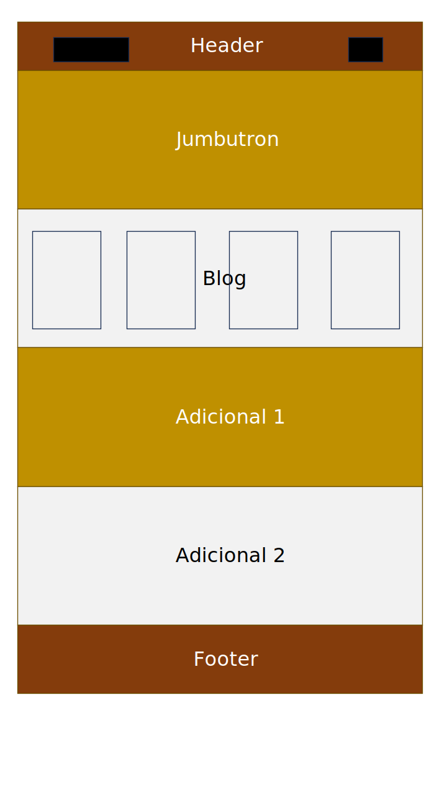

# Proyecto_Landing Meow Café

## **ÍNDICE**
* [1. Prototipado simple](#1-intro)
* [2. Intro](#1-intro)
* [3. Demo ](#2-demo)

## 1. Prototipado simple

## 2. Intro

Este proyecto corresponde a la entrega 1 realizada para Bootcamp de Desarrollador Web Full Stack UDD.

Este, está enfocado en construir una página "landing" para un negocio, en este caso para una página ficticia sobre un cat-café. Se solicitó una sola página que permita establecer:

  - **a. Header** 
    Sección que involucra el logo y las áreas principales del sitio (inicio, contacto, sobre nosotros y reservas).
  - **b. Jumbotron** 
    Sección de presentación del café. Incluye su título, el loco completo y un espacio para dejar su correo, además de un botón donde solicitar un saludo (cumpleaños, aniversarios, alianzas, etc)
  - **c. Blog o catálogo** 
   Sección donde muestra un blog con un catálogo con algunos de los gatos que van a estar en el lugar siendo "anfitriones" del café y una breve descripción de sus personalidades.
  - **d. Adicionales** 
    1.- adicional donde se habla del menú del lugar y se inserta una imagen donde se puede apreciar algunos de los platos del menú. 
    2.- adicional formulario. 
  - **e. Footer** 
    Footer simple donde muestra horarios, un FAQ y las RRSS.

El objetivo principal fue desarrollar una interfaz utilizando HTML y CSS, en toda su aplicación. Utilizando etiquetas estándar HTML5,
y CSS, incluyendo técnicas Flexbox, CSS Grids y Responsive Web Design, para esto se usaron las media query y jquery.

## 3. Demo

La página web corresponde al emprendimiento "Escuela de programación". Enfocado principalmente en realizar talleres que permitan mejorar las habilidades de programación en adultos. 
